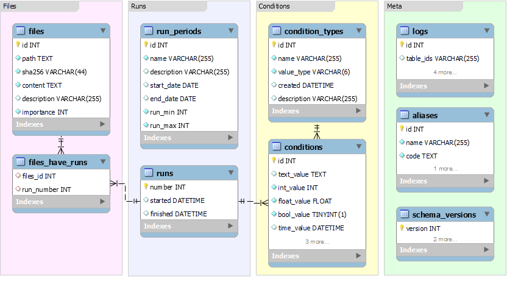

## Database structure explained



The essential database schema is pretty simple and could be split in four groups of tables:

1. Runs. That is where a run numbers and run periods are stored.
2. File storage. Each file has many to many relationship with run numbers.
3. Conditions. Name-value pairs are stored there
4. Meta. Logs and SQL DB schema version

While Run and File storage are pretty simple and self descriptive, Conditions storage requires
additional explanation. 

In terms of RCDB, ```Conditions``` are name-value pairs attached to runs. So it is like:

```
RUN -- NAME -- VALUE
```

The essential RCDB feature is that while all runs may have a common set of name-value pairs (e.g. event_count, run_type), some runs may have special name-value pairs, that are not relevant for other runs. For example one may have trigger study with some trigger specific values that doesn't make sense for physics runs. The same could be imagined for for calibration runs. 

With this feature in mind, it is not optimal to create just one table with all possible conditions as columns and all values as rows (huge rows). Instead, RCDB uses so called "hybrid approach to object-attribute-value model". The are two tables: ```conditions``` that stores actual values and ```condition_types``` that holds information of condition names and their real types. ```conditions``` table has several columns to store different types of values.


| Storage column| Data type |
|---------------|------------|
|text_value     |strings, json, blobs, long texts |
|int_value      |integers  |
|float_value    |floats |
|bool_value     |booleans  |
|time_value     |date time values|

***Why is it so?*** - because we would like to have queries like: *"give me runs where event_count > 100 000"*

i.e., if we know that **event_count* is int, we would like database to treat it as int. At the same time we would like to store strings and more general data with blobs. 

If value is int, float, bool or time, it is stored in appropriate field, which allows to use its type when querying and searching over them. At the same time, more complex objects as JSON or blobs can be stored... to figure out them lately

This approach adds some complexity for its flexibility. But those complexities are minimized by APIs, which automate type checks. So finally users work with just run-name-values, leaving the complexities under the hood of APIs. 

Lets look at python API as an example


<br> 

## Python

Python API data model classes resembles this structure. Most common python classes that you work with:

* **Run** - represents run
* **Condition** - stores data for the run
* **ConditionType** - stores condition name, field type and other


All classes have properties to reference each other. The main properties for conditions management are:

```python
class Run(ModelBase):
    number                  # int - The run number
    start_time              # datetime - Run start time
    end_time                # datetime - Run end time
    conditions              # list[Condition] - Conditions associated with the run


class ConditionType(ModelBase):
    name               # str(max 255) - A name of condition
    value_type         # str(max 255) - Type name. One of XXX_FIELD below
    values             # query[Condition] - query to look condition values for runs

    # Constants, used for declaration of value_type
    STRING_FIELD = "string"
    INT_FIELD = "int"
    BOOL_FIELD = "bool"
    FLOAT_FIELD = "float"
    JSON_FIELD = "json"
    BLOB_FIELD = "blob"
    TIME_FIELD = "time"


class Condition(ModelBase):
    time           # datetime - time related to condition (when it occurred in example)
    run_number     # int - the run number

    @property
    value          # int, float, bool or string - depending on type. The condition value

    text_value     # holds data if type STRING_FIELD,JSON_FIELD or BLOB_FIELD
    int_value      # holds data if type INT_FIELD
    float_value    # holds data if type FLOAT_FIELD
    bool_value     # holds data if type BOOL_FIELD

    run            # Run - Run object associated with the run_number
    type           # ConditionType - link to associated condition type
    name           # str - link to type.name. See ConditionType.name
    value_type     # str - link to type.value_type. See ConditionType.value_type
```


#### How data is stored in the DB 

In general, one just uses Condition.value to get the right value for the condition. But what happens under the hood? 

As you may noticed from comments above, in reality data is stored in one of the fields:

| Storage field | Value type |
|---------------|------------|
|text_value     |STRING_FIELD, JSON_FIELD or BLOB_FIELD |
|int_value      |INT_FIELD   |
|float_value    |FLOAT_FIELD |
|bool_value     |BOOL_FIELD  |
|time_value     |TIME_FIELD  |


When you call **Condition.value** property, Condition class checks for **type.value_type** and returns
an appropriate **xxx_value**.

## SQL queries

One can directly use SQL queries to retrieve conditions data, extending use of RCDB for other languages than supporting and also getting the maximum performance of retrieving the data. 

Examples of raw SQL queries [are located in sql/examples folder](https://github.com/JeffersonLab/rcdb/tree/dev0.9/sql/examples)

### Select available conditions

Information about conditions available is stored in `condition_types` table. So getting information about all conditions is straight forward:

```sql
select * from condition_types;
```

### Select conditions for a run

`condition_types` describing conditions parameters, such as name and type. `conditions` which are created for each value of each run are connected both with `condition_types` and `runs`. The only caveat selecting them is that `conditions` may hold values in one of the data fields such as `int_value`, `float_value` etc. 

To create a query that automatically selects the right value field for a specific condition type and run number, we use conditional logic in our SQL query. This process requires linking the conditions table with the condition_types table, filtering by the condition type name and run number. Then, we use a CASE statement to pick the correct value field, like text_value, int_value, etc., based on the condition type's data type.

HallD RCDB db is used for this example:

```sql
SELECT
    c.id AS condition_id,
    ct.name AS condition_type_name,
    c.run_number,
    CASE
        WHEN ct.value_type = 'float' THEN CAST(c.float_value AS CHAR)
        WHEN ct.value_type = 'int' THEN CAST(c.int_value AS CHAR)
        WHEN ct.value_type = 'string' THEN c.text_value
        WHEN ct.value_type = 'bool' THEN CAST(c.bool_value AS CHAR)
        WHEN ct.value_type = 'json' THEN c.text_value -- Assuming JSON is stored as text
        WHEN ct.value_type = 'time' THEN CAST(c.time_value AS CHAR)
        ELSE 'Value Type Not Supported'
        END AS condition_value
FROM
    conditions c
        JOIN
    condition_types ct ON c.condition_type_id = ct.id
WHERE
    ct.name = 'beam_current' -- <== Replace with your condition type name
  AND c.run_number = 51269;  -- <== Replace with your specific run number
```

Apparently if one removes `ct.name = 'beam_current' AND` from the above query - all conditions for run 51269 will be selected. 

### Search over runs, select runs and conditions

The fact that `conditions` store values in typed fields such as `int_value`, `float_value` etc. gives the opportunity to search of conditions and selecting runs right in SQL using DB engine and probably having the maximum performance. 

The next query selects the specified conditions over a range of runs.
Returns a convenient table where rows correspond to each selected run
and columns are condition values.

1. note that types of values of conditions are specified manually:
    `event_count_table.int_value event_count`
    So one has to change it according to condition types

2. Search over specified criteria is used here:
   `event_count_table.int_value > 1000000`
   you can omit it to get all runs and specified conditions

3. If run didn't have a condition attached, the value will be null

```sql
  SELECT
    runs.number                          run,
    event_rate_table.float_value         event_rate,
    event_count_table.int_value          event_count,
    run_type_table.text_value            run_type,
    run_config_table.text_value          run_config,
    polarization_angle_table.float_value polarization_angle
  FROM runs
    LEFT JOIN conditions event_rate_table
      ON event_rate_table.run_number = runs.number AND event_rate_table.condition_type_id = 1
    LEFT JOIN conditions event_count_table
      ON event_count_table.run_number = runs.number AND event_count_table.condition_type_id = 2
    LEFT JOIN conditions run_type_table
      ON run_type_table.run_number = runs.number AND run_type_table.condition_type_id = 3
    LEFT JOIN conditions run_config_table
      ON run_config_table.run_number = runs.number AND run_config_table.condition_type_id = 4
    LEFT JOIN conditions polarization_angle_table
      ON polarization_angle_table.run_number = runs.number AND polarization_angle_table.condition_type_id = 56
  WHERE
      runs.number > 10000
    AND
      event_count_table.int_value > 1000000
;
```


### Get files for a run

To retrieve information about files associated with a particular run, we'll rely on the relationships established in your database schema. `files` are related to `runs` through the `files_have_runs` table, which acts as a junction table between files and runs.

The next query gets all files associated with the run (HallD RCDB DB and Run 51269 is used as an example)

```sql
SELECT f.id, f.path, f.sha256, f.content, f.description, f.importance
FROM files f
         INNER JOIN files_have_runs fr ON f.id = fr.files_id
WHERE fr.run_number = 51269;
```

> Here we assume that files in RCDB are small config files and fetch f.content right away. If huge files are stored, it might be beneficial to fetch them separately. 

### Get runs which use a file

The opposite task is to select all runs that use a particular configuration file identified by system path and sha256. 

```sql
/*
    Select all runs that use a particular file identified by path and sha256
 */
SELECT DISTINCT r.number AS run_number, r.started, r.finished
FROM runs r
         INNER JOIN files_have_runs fr ON r.number = fr.run_number
         INNER JOIN files f ON fr.files_id = f.id
WHERE f.path = '/gluondaqfs/hdops/CDAQ/daq_dev_v0.31/daq/config/hd_all/FCAL_BCAL_PS_m9.conf'
  AND f.sha256 = 'So3FTmV4Md8+Ang5Z3E8fOdFmQ3FyDbSMyObWOeyKYw=';
```