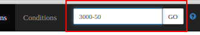

The search box at the top of the runs page lets you filter runs by run range and by a condition query.

## Run range

- **Run min** / **Run max** — set the lower and upper run numbers of the range. Leave **Run min** empty for `0` and **Run max** empty for infinity.
- Each field has a **Run periods** dropdown picker. Selecting a run period fills both **Run min** and **Run max** with that period's run range.

## Search query

The **Search query** field accepts the RCDB query language, for example:

```
event_count>10000 and @is_production
```

It provides several helpers:

- **Standard search aliases** dropdown — inserts one of the predefined aliases (e.g. `@is_production`) into the query.
- **Condition type selection** — the list button opens a dialog with all available condition types (name, type, and description); selecting one inserts its name into the query.
- **Autocomplete** — suggests condition types and aliases as you type.

## Form persistence

The entered run range and query are saved in the browser (localStorage) and restored the next time you open the page, so your last search is preserved.
